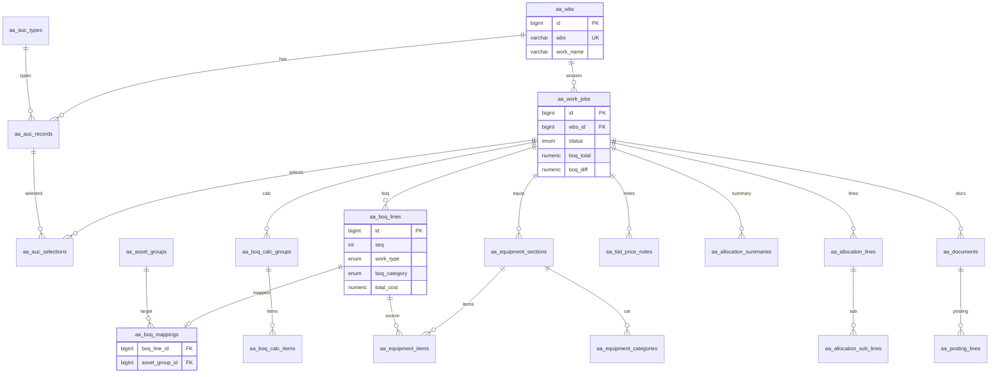
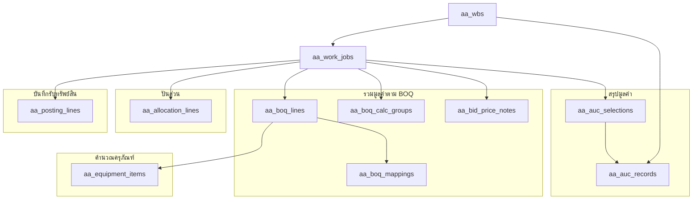

# Asset Acceptance ONLY — ERD (เฉพาะ feature นี้)

> ตัดออก: contracts, substations, agreements, SAP sync, status history  
> Prefix ตาราง: `aa_` = asset acceptance

## ไฟล์

| ไฟล์ | ใช้งาน |
|------|--------|
| `asset-acceptance-only.dbml` | Import dbdiagram.io |
| `asset-acceptance-only.schema.sql` | PostgreSQL DDL |
| `asset-acceptance-only.queries.sql` | ตัวอย่าง query |

---

## ERD ภาพรวม



---

## โครงสร้างตามแท็บ UI



---

## FK Map (20 ตาราง)

```
aa_wbs
  ├── aa_auc_records
  └── aa_work_jobs                    ← ROOT
        ├── aa_auc_selections → aa_auc_records
        ├── aa_boq_lines
        │     └── aa_boq_mappings → aa_asset_groups
        ├── aa_boq_calc_groups → aa_boq_calc_items
        ├── aa_equipment_sections
        │     ├── aa_equipment_categories
        │     └── aa_equipment_items → aa_asset_types, aa_asset_sub_types
        ├── aa_bid_price_notes
        ├── aa_allocation_summaries
        ├── aa_allocation_lines → aa_asset_classes, aa_account_codes
        │     └── aa_allocation_sub_lines
        └── aa_documents
              ├── aa_posting_lines
              └── aa_report_preview_rows
```

---

## Map UI → ตาราง

| แท็บ | ตาราง |
|------|--------|
| สรุปมูลค่า | `aa_auc_records`, `aa_auc_selections` |
| รายการ BOQ | `aa_boq_lines`, `aa_boq_mappings` |
| คำนวณมูลค่า | `aa_boq_calc_groups`, `aa_boq_calc_items` |
| SUMMARY OF BID PRICE | `aa_bid_price_notes` |
| คำนวณครุภัณฑ์ | `aa_equipment_sections`, `aa_equipment_items` |
| ปันส่วน | `aa_allocation_summaries`, `aa_allocation_lines` |
| บันทึกรับทรัพย์สิน | `aa_documents`, `aa_posting_lines` |

---

## เปรียบเทียบกับ schema เต็ม

| รายการ | Schema เต็ม | Schema ONLY |
|--------|-------------|-------------|
| ตาราง | ~26 | **20** |
| contracts/substations | มี | **ไม่มี** |
| Entry point | contract_wbs | **aa_wbs** |
| Prefix | work_job_* | **aa_*** |
| Scope | ทั้งโครงการ | **เฉพาะ Asset Acceptance** |
